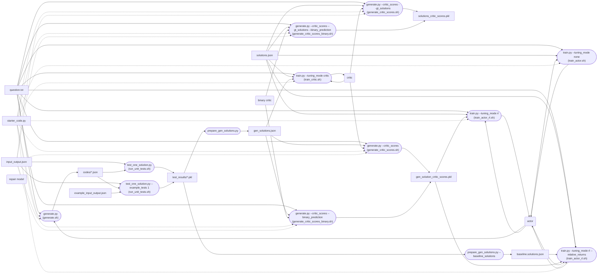
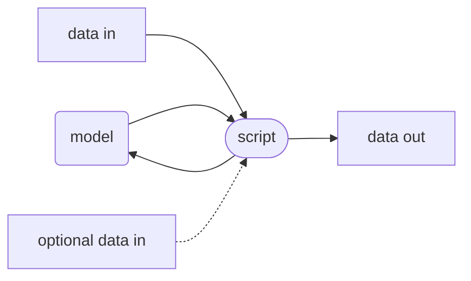

# CodeRL Workflows

```mermaid
flowchart LR
	%% data
	question[question.txt]
	starter[starter_code.py]
	inOut[input_output.json]
	exInOut[example_input_output.json]
	codes[codes/*.json]
	results[test_results/*.pkl]
	base[baseline.solutions.json]
	sol[solutions.json]
	genSol[gen_solutions.json]
	solCritSc[solutions_critic_scores.pkl]
	genSolCritSc[gen_solution_critic_scores.pkl]

	%% models
	actor(actor)
	critic(critic)
	critic2(binary critic)
	repair(repair model)

	%% scripts
	gen(["generate.py<br>(generate.sh)"])
	genCritSc(["generate.py --critic_scores<br>(generate_critic_scores.sh)"])
	genCritScGT(["generate.py --critic_scores --gt_solutions<br>(generate_critic_scores.sh)"])
	genCritSc2(["generate.py --critic_scores --binary_prediction<br>(generate_critic_scores_binary.sh)"])
	genCritSc2GT(["generate.py --critic_scores --gt_solutions --binary_prediction<br>(generate_critic_scores_binary.sh)"])
	test(["test_one_solution.py<br>(run_unit_tests.sh)"])
	testEx(["test_one_solution.py --example_tests 1<br>(run_unit_tests.sh)"])
	prep(["prepare_gen_solutions.py"])
	prepBase(["prepare_gen_solutions.py --baseline_solutions"])
	trainAct(["train.py --tuning_mode none<br>(train_actor.sh)"])
	trainActRL(["train.py --tuning_mode rl<br>(train_actor_rl.sh)"])
	trainActRLRel(["train.py --tuning_mode rl --relative_returns<br>(train_actor_rl.sh)"])
	trainCrit(["train.py --tuning_mode critic<br>(train_critic.sh)"])

	%% links

	question & actor --> gen
	starter & inOut -.-> gen
	gen --> codes

	question --> genCritSc & genCritScGT & genCritSc2 & genCritSc2GT
	genSol --> genCritSc & genCritSc2
	sol --> genCritScGT & genCritSc2GT
	critic --> genCritSc & genCritScGT
	critic2 --> genCritSc2 & genCritSc2GT
	starter & inOut -.-> genCritSc & genCritScGT & genCritSc2 & genCritSc2GT
	genCritScGT & genCritSc2GT --> solCritSc
	genCritSc & genCritSc2 --> genSolCritSc

	inOut & codes --> test & testEx
	exInOut --> testEx
	test & testEx --> results

	results --> prep & prepBase
	prep --> genSol
	prepBase --> base

	question & sol --> trainAct & trainActRL & trainActRLRel & trainCrit
	base --> trainActRLRel
	genSol & critic --> trainCrit
	genSolCritSc --> trainActRL & trainActRLRel
	actor --> trainAct & trainActRL & trainActRLRel
	starter -.-> trainAct & trainActRL & trainActRLRel & trainCrit
	trainAct & trainActRL & trainActRLRel --> actor
	trainCrit --> critic
```

## Legend

```mermaid
flowchart LR
	m1(model)
	d1[data in]
	d2[optional data in]
	d3[data out]
	s1([script])
	
	m1 & d1 --> s1
	d2 -.-> s1
	s1 --> m1 & d3
```
